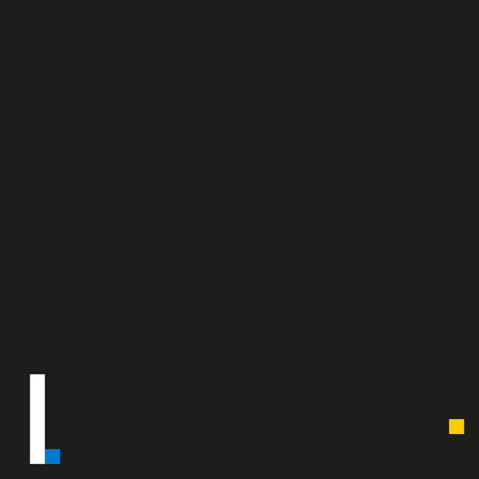

# Snake Game

The code for this repo was inspired by [this](https://codereview.stackexchange.com/questions/212296/snake-game-in-c-with-sdl) StackExchange post and set of responses.

## Dependencies for Running Locally
* cmake >= 3.7  
  * CMake is cross-platform free and open-source software for build automation, testing, packaging and installation of software by using a compiler-independent method.
  * All OSes: [installation instructions](https://cmake.org/install/)
  
* make >= 4.1 (Linux, Mac), 3.81 (Windows)
  * Make is a build automation tool that automatically builds executable programs and libraries from source code by reading files called Makefiles which specify how to derive the target program.
  * Linux: make is installed by default on most Linux distributions
  * Mac: [Xcode command line tools to get make](https://developer.apple.com/xcode/features/)
  * Windows: [installation instructions](http://gnuwin32.sourceforge.net/packages/make.htm)
  
* SDL2 (Simple DirectMedia Layer)>= 2.0  
  * The Simple DirectMedia Layer is a cross-platform software development library designed to provide a hardware abstraction layer for computer multimedia hardware components.
  * Installation instructions [here](https://wiki.libsdl.org/Installation)
  > For Linux-based systems, an `apt` or `apt-get` installation from distro package is preferred. A simple `sudo apt-get install libsdl2-dev` does the job. 
  
* gcc/g++ >= 5.4
  * From the GNU compiler collection
  * Linux: gcc / g++ is installed by default on most Linux distributions
  * Mac: [Xcode command line tools](https://developer.apple.com/xcode/features/)
  * Windows: [MinGW](http://www.mingw.org/)

## Code Structure  

## Basic Build Instructions

1. Open Command Line and clone this repo using `git clone https://github.com/sudipto-g/SnakeGame.git`
2. Next, create a build directory in the top level directory/root using `mkdir build && cd build`
3. Compile the code using `cmake .. && make`
4. Run using `./SnakeGame`

## CC Attribution-ShareAlike 4.0 International

Shield: [![CC BY-SA 4.0][cc-by-sa-shield]][cc-by-sa]

This work is licensed under a
[Creative Commons Attribution-ShareAlike 4.0 International License][cc-by-sa].

[![CC BY-SA 4.0][cc-by-sa-image]][cc-by-sa]

[cc-by-sa]: http://creativecommons.org/licenses/by-sa/4.0/
[cc-by-sa-image]: https://licensebuttons.net/l/by-sa/4.0/88x31.png
[cc-by-sa-shield]: https://img.shields.io/badge/License-CC%20BY--SA%204.0-lightgrey.svg